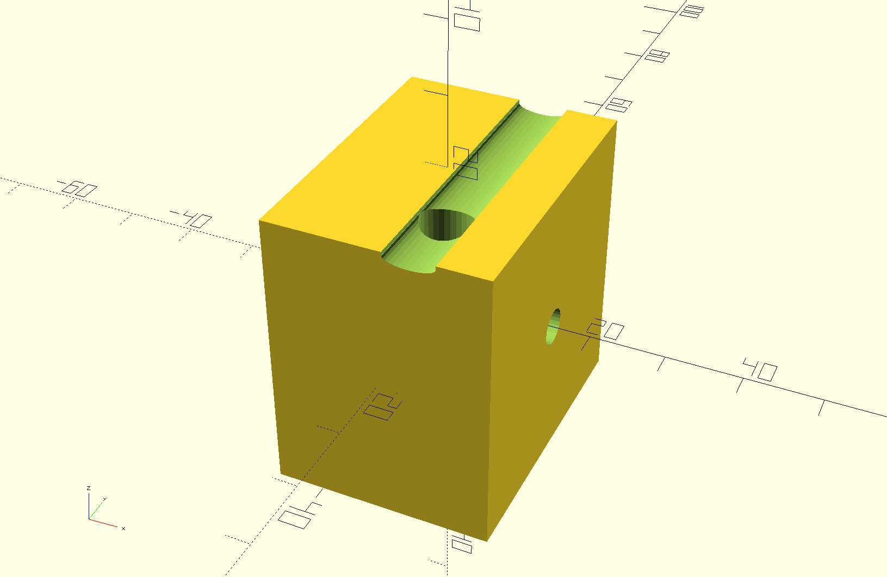
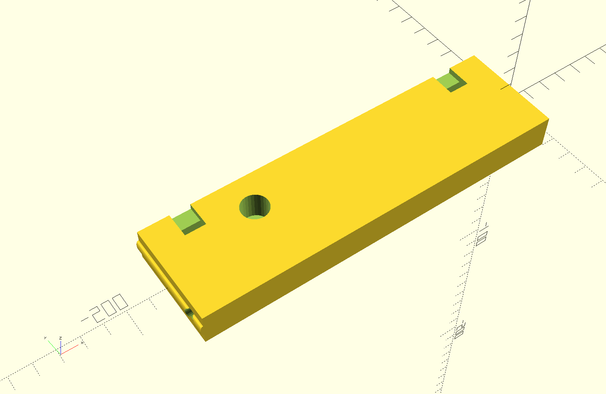
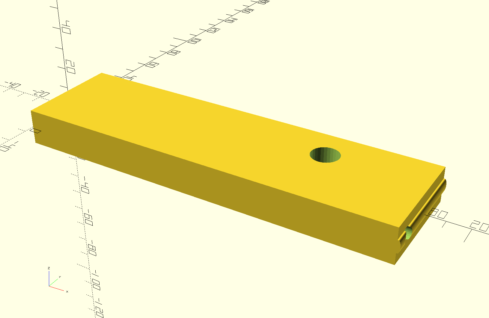

# A Hinge For Mounting a Display Monitor Under a Shelf

The default settings match the dimensions of a ZSCMALLS Portable 15.6 Inch monitor.
Available from Amazon in November 2011 for $129.99 (ASIN: B07VFF4TZG)

Use a 1/4" threaded-rod as the hinge-pin with wingnuts on the ends.

## Mounting block 

Use the small hole to mount under shelf with a drywall screw.

## Left-side Monitor Bracket

Note that the square holes are so you can loop the cables up and use zip-ties 
to relieve the strain on the side-connectors.

The round holes align with the mounting bolt holes on the monitor and the big 
countersinks allow you to reuse the bolts that come with the monitor.

## Right-side Monitor Bracket

